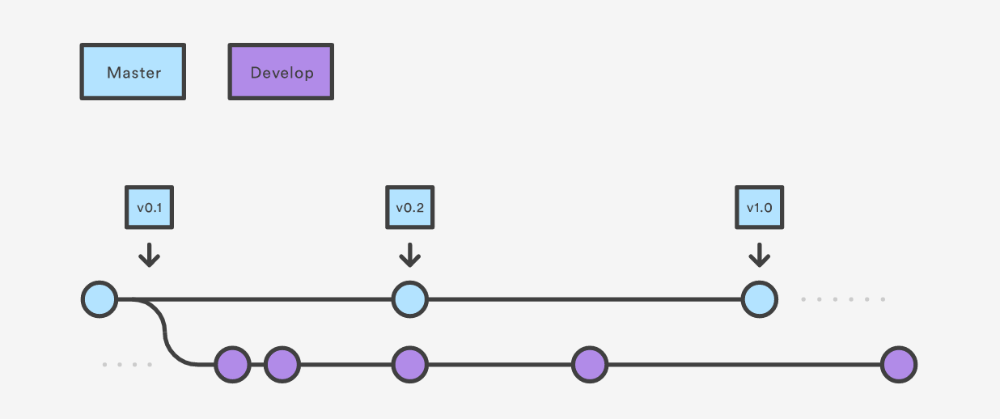

# Git Intermediate - Branching 

Now we're going to dive into some workflow activites with git that including branching and merging.


At this point, you should have forked and cloned to your local machine the github respository [Nicecream Icecream - Los Angeles's Finest Hipster Icecream Startup](https://github.com/ndanielsen/nicecream.github.io)


**Protip**

After the workshop, install [git-completion](https://github.com/bobthecow/git-flow-completion/wiki/Install-Bash-git-completion) to make using git much easier by enabling autocompletion.

It requires modifying your `~/.bash_profile` or equivalent.


## Git Branches

A branch represents a different line or work that is separated from the `main` or `master` branch. It is a helpful mechanism for allowing multiple people to work on the same git repository (and github project) in potentially overlapping locations without stepping on too many toes.

In git, we use branches to work in parallel and then merge our code together.


[Atlassian Image Credit](https://www.atlassian.com/git/tutorials/comparing-workflows/gitflow-workflow)


Check out the current branch for your `nicecream.github.io` project.

```

 $ git branch

```

You should only have the master branch.


### Git workflows with branches

In most project management systems, it is typical to pick up a story or card to work on. In this case, we have a [card waiting](https://github.com/ndanielsen/nicecream.github.io/issues/1) for us.

We will utilize a feature branch to work on this item in parallel. A feature branch is a change or body of work related to a single assignment. 

Read more about [gitflows here.](https://www.atlassian.com/git/tutorials/comparing-workflows/gitflow-workflow)


### Github Issue

Let's take a look at the [card](https://github.com/ndanielsen/nicecream.github.io/issues/1) together. 

In doing this, we should compare the `index.html` is our current `master` branch with the ticket. We can open up the `index.html` in our browser to see it.


### Exercise

Compare the image in the [card](https://github.com/ndanielsen/nicecream.github.io/issues/1) with the current `index.html` in the master branch.


### Creating a branch

With an assignment to work on, let's create a branch to add the tagline onto our page.

```
 $ git branch 1-add-tag-line
 $ git branch

```

Let's now move into that branch and add in our tagline.

```
 $ git checkout 1-add-tag-line
 $ git branch

```

#### Exercise:
1) Open up the `index.html` in `nicecream.github.io` and add your flavor that you came up with earlier.
2) Git commit and push it up to your forked copy of the respository.
2) Go to your forked github `nicecream.github.io` repo to make sure that it made it in.
3) On github, make a pull request into your `master` branch and then merge it in.


#### Protip: 
You can create and checkout a branch in one command.

```

 $ git checkout -b 1-add-tag-line`

```


### Pulling Down a Branch

Now that we have an updated `master` branch. Let's get the same copy of it on our local computer.

```
 $ git checkout master
 $ git pull

```

What is `git pull` doing?

It is `fetch`ing the data from the github server and merging it into the local `master` branch on your computer.

Essentially, it is doing this:

```
$ git fetch`
$ git merge origin/master

```

We will learn more about this in the next section.


#### Exercise:

Now we need to change the company name. 
See this [github issue](https://github.com/ndanielsen/nicecream.github.io/issues/2)

- Create a new local branch.
- Make the required changes according to the github issue.
- Commit your changes
- Merge that change into your local `master` branch.

hint: `git merge {branch_name}`


### Resources

Here are a few other resources that might be helpful for diving deeper into git.

- [What is a commit?](https://chris.beams.io/posts/git-commit/)
- [Atlassian Git Tutorial](https://www.atlassian.com/git/tutorials)


### Protip

Don't put your github credentials into git each time when pushing or pulling down work. Setup ssh.

What is SSH? Why set it up for communicating with github?

https://help.github.com/en/enterprise/2.15/user/articles/adding-a-new-ssh-key-to-your-github-account
